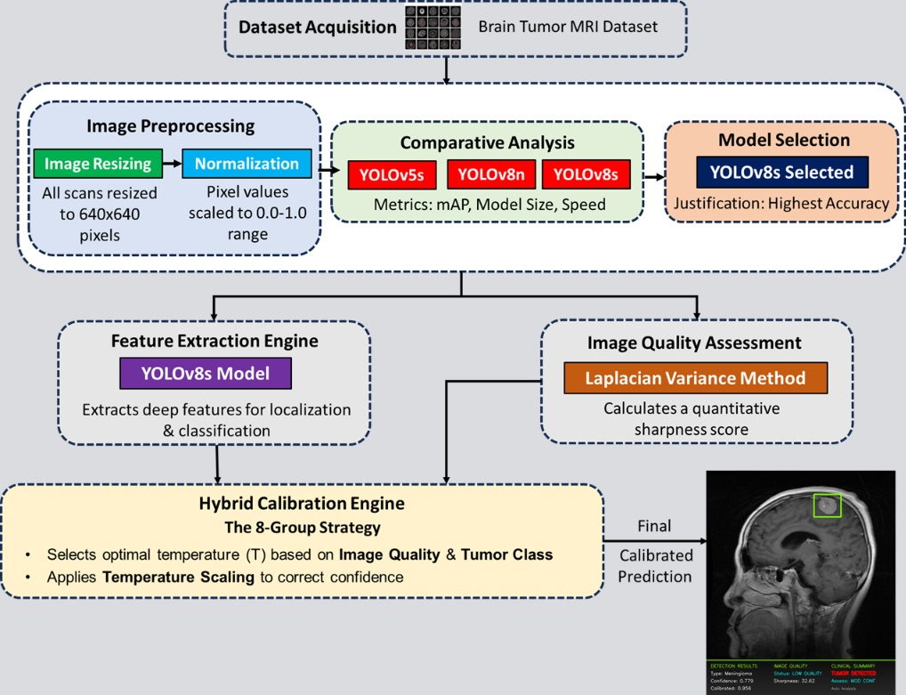
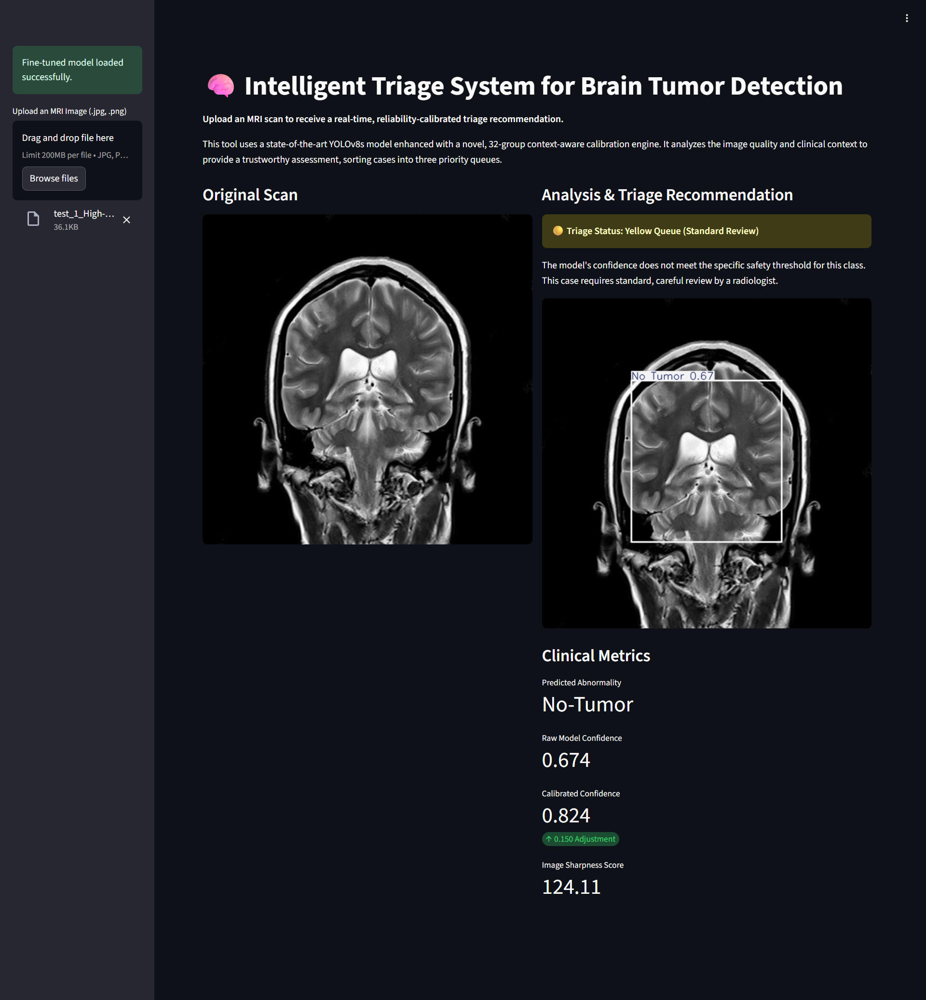

# Trustworthy AI Framework for Clinical Deployment

A novel, clinically-aware calibration framework to improve the reliability of AI models for brain tumor detection. This project transforms a high-accuracy "black box" model into a trustworthy clinical tool by making its confidence scores sensitive to the context of each individual medical scan.


*A visual summary showing the initial miscalibrated model, our final calibrated output, and the intelligent triage application.*

---

## 📚 Table of Contents
- [The Problem: The "Trust Gap" in Medical AI](#the-problem-the-trust-gap-in-medical-ai)
- [Our Novel Solution: A Clinically-Aware Framework](#our-novel-solution-a-clinically-aware-framework)
- [🏗️ System Architecture](#️-system-architecture)
- [🛠️ Tech Stack](#️-tech-stack)
- [📊 Key Results](#-key-results)
- [⚙️ Setup and Installation](#️-setup-and-installation)
- [🚀 Usage](#-usage)
- [📄 License](#-license)

---

## The Problem: The "Trust Gap" in Medical AI

State-of-the-art deep learning models like YOLOv8 can detect brain tumors with over 97% accuracy. However, **high accuracy is not enough for safe clinical adoption.** These models are often poorly calibrated, meaning their confidence scores do not reflect the true probability of being correct. For example, a model might be 95% confident but correct only 75% of the time. This "trust gap" makes it dangerous to use these models for high-stakes decisions, like prioritizing patient scans.

Our baseline evaluation of a standard YOLOv8s model confirmed this issue, revealing a high **Expected Calibration Error (ECE) of 0.199**, indicating significant overconfidence.


*The initial reliability diagram of the baseline model, showing a clear gap between confidence (orange) and actual accuracy (blue), quantifying the "trust gap."*

---

## Our Novel Solution: A Clinically-Aware Framework

This project introduces a multi-stage, context-aware calibration framework that addresses the research gaps in existing literature. Instead of using a "one-size-fits-all" correction, our engine dynamically adjusts the model's confidence based on clinically relevant factors.

### Key Features & Contributions

1.  **Image Quality Assessment Module:**
    * We engineered a module to quantify the sharpness of every MRI scan using the **Variance of the Laplacian**, a fast and effective proxy for image quality. Our analysis provided definitive evidence that low image quality directly correlates with reduced model reliability, justifying a quality-aware approach.

2.  **Context-Aware Calibration Engine:**
    * **The Super-Hybrid Method (32 Groups):** Going beyond simple calibration, we performed a detailed error analysis and found that a model's reliability is affected by a combination of **image quality, tumor class, tumor size, and location**. We developed a fine-grained calibration strategy that learns a unique correction temperature for 32 distinct clinical contexts.
    * **Dynamic Temperature Regression (DTR) - The Final Model:** Our most advanced contribution is a regression model (`GradientBoostingRegressor`) that *predicts* the optimal calibration temperature in real-time based on a continuous vector of clinical features. This moves beyond discrete groups to provide an infinitely granular and adaptive calibration, achieving the best performance.

3.  **Model-Agnostic Validation:**
    * We proved our calibration framework is a generalizable solution by applying it to a completely different architecture (**YOLOv5s**). The framework still achieved a significant **~30% improvement in reliability**, demonstrating its robustness.

4.  **Intelligent Triage System:**
    * A complete clinical triage application was developed and deployed using **Streamlit**. The application uses the trustworthy, calibrated confidence scores to automatically sort cases into three priority queues: **Red (Urgent)**, **Yellow (Standard)**, and **Green (Routine)**, simulating a real-world clinical workflow.

---

## 🏗️ System Architecture

The framework is designed as a modular, parallel-processing pipeline that transforms a raw MRI scan into a final, trustworthy clinical recommendation.


*The end-to-end workflow from image preprocessing and model selection to the parallel feature extraction and quality assessment, which converge at our novel Hybrid Calibration Engine.*

---

## 🛠️ Tech Stack

- **Backend & Core Logic:** Python, FastAPI, WebSockets
- **AI / Machine Learning:** PyTorch, Ultralytics YOLOv8, Scikit-learn, Sentence Transformers
- **Data Science & Processing:** Pandas, NumPy, OpenCV, Nibabel
- **Database:** PostgreSQL, ChromaDB (Vector DB)
- **Frontend & Deployment:** Streamlit, Next.js, React.js, Flutter
- **DevOps & Tools:** Git, GitHub, VS Code, Google Colab Pro

---

## 📊 Key Results

Our final **Dynamic Temperature Regression (DTR)** method delivered a statistically significant improvement in model reliability on an unseen test set.

### **Over 50% Reduction in Calibration Error**

The framework successfully bridged the "trust gap" by making the model's confidence scores remarkably more reliable.

| Method                    | Expected Calibration Error (ECE) | Improvement |
| ------------------------- | -------------------------------- | ----------- |
| Baseline (Uncalibrated)   | 0.199                            | -           |
| **Our DTR Method (Final)**| **0.096** | **51.7%** |


*The final reliability diagram after applying our DTR calibration method. The gaps are visibly closed, and the model is now highly trustworthy.*

### Deployed Triage Application

The final Streamlit application provides a clean, interactive interface for clinicians to upload scans and receive an instant, reliable triage recommendation.



---

## ⚙️ Setup and Installation

To set up and run this project locally, follow these steps:

1.  **Clone the repository:**
    ```bash
    git clone https://github.com/your-username/Trustworthy-AI-for-Medical-Imaging.git
    cd Trustworthy-AI-for-Medical-Imaging
    ```

2.  **Create a virtual environment:**
    ```bash
    python -m venv venv
    source venv/bin/activate  # On Windows, use `venv\Scripts\activate`
    ```

3.  **Install dependencies:**
    A `requirements.txt` file is provided with all necessary packages.
    ```bash
    pip install -r requirements.txt
    ```

**`requirements.txt`:**
```
torch
torchvision
ultralytics
streamlit
pandas
numpy
scikit-learn
opencv-python-headless
matplotlib
seaborn
pyngrok
```

---

## 🚀 Usage

The project is divided into two main parts: the analysis notebooks and the final Streamlit application.

### 1. Running the Analysis Notebooks

The core analysis, model training, and calibration logic are contained in Jupyter notebooks (`.ipynb` files). It is recommended to run these in a GPU-enabled environment like Google Colab.

- **`Phase2_Combined_Calibration.ipynb`**: Contains the complete workflow from baseline analysis, image quality assessment, error analysis, and the development of all calibration methods (8-group, 32-group, and DTR).
- **`Phase3_Triage_and_Deployment.ipynb`**: Contains the simulation of the clinical triage system and the code for deploying the Streamlit application.

### 2. Launching the Triage Application

To launch the web application, run the following command in your terminal from the project's root directory:

```bash
streamlit run app.py
```

This will start a local server, and you can access the application by navigating to http://localhost:8501 in your web browser.

---

## 📄 License

This project is licensed under the MIT License. See the LICENSE file for details.
